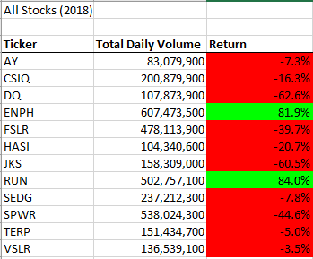

# **Using Excel VBA to Perform Stock Analysis**

## **Overview**

        The purpose of this project is to analyze and compare the performance of 12 stocks for the years 2017 and 2018. To accomplish this, the original code solution from Module 2, All Stock Analysis was refactored with the intent of making it more efficient. 

## **Results**
	
### Original Code Solution
	
	In the original code solution, to get the total volume, and the starting and ending prices, an outer for loop is used to initialize the total volume to zero. Then an inner loop is used to loop over all the rows in the spreadsheet. If then conditionals are used to get the starting and ending prices.  

	* An outer for loop is used to initialize the total volume to zero.

	

	* Then an inner for loop is used to loop over all the rows in the spreadsheet. The iterator will be j instead of 

				

	* If then conditionals are used to find the total volume and the starting and ending prices for each ticker.

	

For 2017, the code run time is 812.427 seconds and the run time for 2018 was 242 seconds. 

	
	
	

### Refactored Code Solution

	For the refactored code, the original code is copied into the VBA editor and slightly modified to decrease the run time but have the same output. To get the total volume, and the starting and ending prices, the same for loop is used to initialize the total volume to zero; however, instead of an inner loop, another for i loop is used to loop around the rows of data. The same if then conditionals will give the start and ending prices. 

	
	
The run time for the 2017 stock analysis is now 0.0625 seconds and 0.070 seconds for 2018. 

	
	
	
	While the run time for the refactored loop is slightly faster, both scripts give the same output for each year’s stock analysis. The stock performance for 2017 had a more positive outcome. Only one stock had a negative return. 2018 on the other hand had more negative returns with only 2 stocks having a positive return. 

	
	
	
  

## **Summary**

	Some of the advantages of refactoring a code are improving the logic, run time, and it makes it easier to read and follow. Since data is ever changing and growing, it is important to improve upon its efficiency.   

	The disadvantage of refactoring a code, if not done properly, can present new problems. As a result, more time will have to be used on debugging. 

### Comparison of the Original and Refactored code

	In the original code, a nested for loop was used to get the total volume and the starting and ending prices. This could account for the additional seconds it took for the code to run through all the data. While nested for loops are useful and at times necessary, it might not be useful for when having to loop through large amounts of data. The refactored code did not require a nested for loop and as a result, ran quicker. This also made the script easier to read and follow. In short, the refactored code turned out to be the more efficient as intended. 

